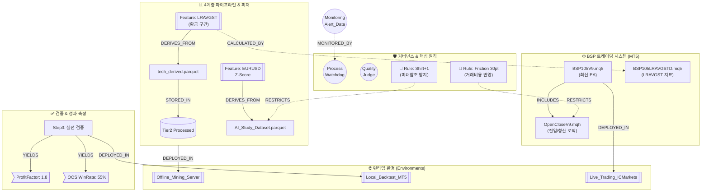

# 프로젝트 온톨로지(Ontology) 기반 그래프 DB 설계 — 프로젝트 매니저 관점

> **목적**: XAUUSD AI 퀀트 트레이딩 시스템의 모든 구성 요소(코드, 데이터, 에이전트, 문서, 규칙, 전략, 워크플로우, 인력 역할)를 하나의 지식 그래프로 연결하여 **"이것을 바꾸면 저것이 깨진다"**를 즉시 추적할 수 있는 프로젝트 관리용 온톨로지입니다.

---

## 1. 엔티티(Node) 클래스 정의 — 총 19종

프로젝트를 구성하는 모든 객체를 다음 19개 클래스로 분류합니다.

### A. 소프트웨어 & 코드

| 클래스 | 설명 | 인스턴스 예시 |
|:---|:---|:---|
| **`ExpertAdvisor`** | 메인 EA (.mq5) — 실전 트레이딩 실행 단위 | `BSP105V9.mq5`, `BSP105V8.mq5` |
| **`FrameworkModule`** | BSP 프레임워크 모듈 (.mqh) — EA를 구성하는 부품 | `OpenCloseV9`, `TrailingStopV9`, `MoneyManageV9` |
| **`Indicator`** | 커스텀 기술 지표 (.mq5) — 차트에 시그널 생성 | `BSP105NLR`, `BSP105LRAVGSTD`, `ChoppingIndex`, `ADXS` |
| **`Script`** | Python/PS1 빌드·분석 스크립트 — ETL/빌드/검증 도구 | `build_data_lake.py`, `merge_features.py`, `fetch_macro_data.py` |

### B. 데이터 & 성과

| 클래스 | 설명 | 인스턴스 예시 |
|:---|:---|:---|
| **`DataLayer`** | 4계층 데이터 파이프라인 계층 | `Tier1_Raw`, `Tier2_Processed`, `Tier3_Labeled`, `Tier4_VectorDB` |
| **`DataArtifact`** | 파이프라인이 생산하는 데이터 산출물 | `tech_features.parquet`, `AI_Study_Dataset.parquet`, `Yahoo_CSVs` |
| **`Feature`** | AI 모델에 투입되는 개별 피처 (480+개) | `UST10Y_ret1d`, `EURUSD_zscore_240`, `M5_iBWMFI`, `M5_CVD` |
| **`MacroSymbol`** | 외부 매크로 데이터 소스 심볼 | `UST10Y_H6`, `DXY_H6`, `VIX_H6`, `EURUSD` |
| 🌟 **`PerformanceMetric`** | 전략 검증 및 백테스트 결과 지표 | `OOS_WinRate(55%)`, `ProfitFactor(1.8)`, `MaxDrawdown(12%)`, `SharpeRatio` |

### C. 프로세스 & 거버넌스

| 클래스 | 설명 | 인스턴스 예시 |
|:---|:---|:---|
| **`Agent`** | AI 에이전트 역할 정의 (Agents/) | `1_Data_Prep`, `5_Strategy_Designer` |
| **`Role`** | 개발·거버넌스 페르소나 | `Process_Watchdog`, `Quality_Judge`, `Quant_Researcher` |
| **`StrategyRule`** | 절대 준수 원칙 + 전략 규칙 | `Rule_Shift+1`, `Rule_Friction_Cost_30pt`, `TrailingStop_Exit_Only` |
| **`Workflow`** | 자동화 워크플로우 (.agent/workflows/) | `data-fetch`, `data-build`, `mql5-port-verify` |
| **`Document`** | 마스터 문서 (단일 진실 공급원) | `GEMINI.md`, `종합 로드맵.md`, `피처 완전 가이드.md` |

### D. 운영 인프라

| 클래스 | 설명 | 인스턴스 예시 |
|:---|:---|:---|
| 🌟 **`Environment`** | 스크립트/EA가 실행되는 런타임 환경 | `Offline_Mining_Server`, `Local_Backtest_MT5`, `Live_Trading_ICMarkets` |
| 🌟 **`MonitoringAlert`** | 시스템 운영 상 발생하는 에러/경고 노드 | `DataSyncDelay`, `MT5Disconnect`, `ZeroBalanceAlert`, `PredictionTimeout` |

### E. 지식 및 아이디어 기록 (Knowledge & Logging)

| 클래스 | 설명 | 인스턴스 예시 |
|:---|:---|:---|
| 🌟 **`Idea`** | 대화나 회의 중 도출된 새로운 발상, 가설, 시도해볼 만한 아이디어 | `Asymmetric_Loss_도입`, `Feature_Pruning_추가`, `WalkForward_주기변경` |
| 🌟 **`Insight`** | 검증 결과나 분석에 의해 확정된 교훈 및 통찰 | `하락장_숏_상승장_롱_비대칭성`, `RSI_단독사용불가` |

### F. 프로젝트 로드맵 (Project Roadmap)

| 클래스 | 설명 | 인스턴스 예시 |
|:---|:---|:---|
| 🌟 **`Phase`** | 프로젝트 대단계 (로드맵 레벨). 상태: `✅완료`, `🚀진행중`, `⬜미착수` | `Phase1_DataLake`, `Phase2_AI_Training`, `Phase3_WalkForward`, `Phase4_LiveDeploy` |
| 🌟 **`Milestone`** | 각 Phase 내의 세부 완료 조건 (체크포인트) | `MS_매크로수집완료`, `MS_라벨링완료`, `MS_SHAP분석완료`, `MS_Step3통과` |

---

## 2. 관계(Edge) 정의 — 총 26종

### 데이터 흐름 (Data Lineage)

| 관계 | 방향 | 의미 | 예시 |
|:---|:---|:---|:---|
| **`PRODUCES`** | Script → DataArtifact | 스크립트가 데이터를 생성함 | `build_data_lake.py` → `macro_features.parquet` |
| **`CONSUMES`** | Script/Agent/EA → DataArtifact | 데이터를 읽어서 사용함 | `merge_features.py` ← `tech_features_derived.parquet` |
| **`STORED_IN`** | DataArtifact → DataLayer | 데이터가 어느 계층에 저장됨 | `macro_features.parquet` → `Tier2_Processed` |
| **`FEEDS`** | MacroSymbol → DataArtifact | 외부 소스가 원본 데이터 제공 | `UST10Y_H6` → `Yahoo_CSVs` |
| **`DERIVES_FROM`** | Feature → DataArtifact | 피처가 어떤 데이터에서 파생됨 | `UST10Y_zscore_240` ← `macro_features.parquet` |
| 🌟 **`CALCULATED_BY`** | Feature → Indicator | 피처가 MQL5 지표로직에 의해 계산됨 | `LRAVGST_Avg(180)_BSPScale` ← `BSP105LRAVGSTD.mq5` |

### 시스템 의존성 (Code Dependencies)

| 관계 | 방향 | 의미 | 예시 |
|:---|:---|:---|:---|
| **`INCLUDES`** | EA → FrameworkModule | EA가 프레임워크 모듈을 임포트 | `BSP105V9.mq5` → `OpenCloseV9.mqh` |
| **`CALLS`** | FrameworkModule → Indicator | 모듈이 지표를 호출 | `IndicatorV9.mqh` → `BSP105LRAVGSTD` |
| **`EVOLVES_FROM`** | EA/Module → EA/Module | 이전 버전에서 진화 | `BSP105V9.mq5` ← `BSP105V8.mq5` |
| **`TRIGGERS`** | Workflow → Script | 워크플로우가 스크립트를 실행 | `data-build` → `build_tech_derived.py` |

### 거버넌스 & 규칙 적용

| 관계 | 방향 | 의미 | 예시 |
|:---|:---|:---|:---|
| **`RESTRICTS`** | StrategyRule → DataArtifact/Script/EA | 규칙이 코드/데이터에 제약 부과 | `Rule_Shift+1` → `merge_features.py` |
| **`GOVERNS`** | Role → Agent/Workflow | 거버넌스 역할이 프로세스를 감독 | `Quality_Judge` → `data-build` |
| **`DEFINED_IN`** | StrategyRule/Metric → Document | 규칙/지표가 어느 문서에 명시됨 | `Rule_Friction_Cost_30pt` → `GEMINI.md` |
| **`IMPLEMENTS`** | Script/Module → StrategyRule | 코드가 규칙을 구현 | `TrailingStopV9.mqh` → `TrailingStop_Exit_Only` |
| **`SUPERVISES`** | Agent → Agent | 에이전트 간 의존 관계 | `1_Data_Prep` → `2_Data_Analyst` |
| 🌟 **`MONITORED_BY`** | MonitoringAlert → Role | 에러/경고를 특정 페르소나가 모니터링 | `DataSyncDelay` → `Process_Watchdog` |
| 🌟 **`GENERATED_BY`** | Idea/Insight → Role/Agent | 아이디어/인사이트를 도출한 주체 | `비대칭손실함수_추가` → `Quant_Researcher` |
| 🌟 **`RELATES_TO`** | Idea/Insight → Entity(모든종류) | 아이디어가 연관성을 갖는 대상 | `비대칭손실함수_추가` → `3_Optimizer` |

### 로드맵 & 진행 관리

| 관계 | 방향 | 의미 | 예시 |
|:---|:---|:---|:---|
| 🌟 **`PRECEDES`** | Phase → Phase | 선행 단계 의존성 (순서 보장) | `Phase1_DataLake` → `Phase2_AI_Training` |
| 🌟 **`CONTAINS`** | Phase → Milestone | 대단계가 세부 마일스톤을 포함 | `Phase2_AI_Training` → `MS_SHAP분석완료` |
| 🌟 **`ACHIEVED_BY`** | Milestone → Script/DataArtifact/EA | 마일스톤을 충족시키는 산출물 | `MS_매크로수집완료` → `macro_features.parquet` |

### 전략 수명 및 인프라 관리

| 관계 | 방향 | 의미 | 예시 |
|:---|:---|:---|:---|
| **`VALIDATES`** | Workflow → EA | Walk-Forward 검증 단계 수행 | `WalkForward_Step1(2개월)` → `WalkForward_Step2(1년)` |
| 🌟 **`YIELDS`** | Workflow/EA → PerformanceMetric | 검증/실전 결과로 성과 지표 산출 | `WalkForward_Step3(최대)` → `OOS_WinRate(55%)` |
| 🌟 **`COMPARES`** | Agent(Analyst) → PerformanceMetric | 두 성과 지표 간의 성능 차이를 비교 | `2_Data_Analyst` → `OOS_WinRate(V8 vs V9)` |
| **`EXPIRES`** | StrategyRule → DataArtifact | 패턴 사전 유효기간 관리 | `PatternDictionary_3Month_TTL` → `VectorDB 패턴 사전` |
| 🌟 **`DEPLOYED_IN`** | EA/Agent/Script → Environment | 코드가 특정 인프라에서 실행됨 | `BSP105V9.mq5` → `Live_Trading_ICMarkets` |
| **`REPORTED_IN`** | Verification → Document | 검증 결과가 문서에 기록됨 | `OOS_2025_결과` → `Memo.md` |

---

## 3. 프로젝트 지식 그래프 (Mermaid) - 매니저 고도화 뷰



---

## 4. 확장된 Cypher 질의 (경영·운영 가치 창출)

### 4-1. [데이터 리니지] 피처 ↔ 지표 ↔ EA 완벽 추적

```cypher
// AI가 중요하다고 꼽은 'LRAVGST' 피처가 어떤 MT5 지표 파일에서 
// 만들어졌고, 어떤 EA 버전에서 실행되고 있는지 도출
MATCH path = (f:Feature {name: 'LRAVGST_Avg(180)_BSPScale'})
             -[:CALCULATED_BY]->(i:Indicator)
             <-[:CALLS]-(m:FrameworkModule)
             <-[:INCLUDES]-(ea:ExpertAdvisor)
RETURN path
```
→ **운영 가치**: MQL5 지표 코드(`Indicator`) 하나를 백업하거나 최적화하려 할 때, 이 코드가 생성해내는 핵심 AI 피처를 놓치지 않고 함께 검증할 수 있습니다.

### 4-2. [성과 비교] EA 버전별 검증 성과(WinRate 등) 즉시 추적

```cypher
// BSP105V8과 V9의 Step3 OOS 테스트 성과(WinRate/ProfitFactor) 비교
MATCH (ea:ExpertAdvisor)-[:INCLUDES]->(m:FrameworkModule {name:'OpenClose'})
MATCH (ea)<-[:VALIDATES]-(w:Workflow)-[:YIELDS]->(metric:PerformanceMetric)
WHERE ea.version IN ['V8', 'V9']
RETURN ea.name, m.responsibility, metric.name
ORDER BY ea.version DESC
```
→ **운영 가치**: 새 버전을 릴리스할 때마다 "왜 이 버전을 라이브에 배포해야 하는지(성능 향상 포인트)"를 데이터 기반 관점에서 증명할 수 있습니다.

### 4-3. [모니터링] 에러 병목 및 담당자 알림 체계

```cypher
// 특정 환경(Live_Trading)에서 발생하는 에러 노드를 담당하는 감시자(Role)
MATCH (ea:ExpertAdvisor)-[:DEPLOYED_IN]->(env:Environment {name: 'Live_Trading_ICMarkets'})
MATCH (ea)-[:TRIGGERS_ALERT]->(alert:MonitoringAlert)
MATCH (alert)-[:MONITORED_BY]->(role:Role)
RETURN alert.name, role.name, ea.name
```
→ **운영 가치**: 런타임 에러(예: 통신 지연/멈춤)가 터졌을 때, 누가 어떻게 개입하여 수습(`Process_Watchdog` 등)해야 하는지 직관적으로 매핑됩니다.

---

## 5. 단계별 구축 고도화 시나리오 (Graph Management)

| 발전 단계 | 관리 도구/기술 | 산출 가치 |
|:---:|:---|:---|
| **Level 1** | 기존 Markdown / Wiki에 Mermaid 삽입 | 개발자·이해관계자 간 시스템 복잡도 "지도" 공유 |
| **Level 2** | `networkx` + `pyvis` (Python 시각화) | 폴더 구조를 자동 스캔하여 `.html` 동적 인터랙티브 차트 탐색 |
| **Level 3** | Neo4j Desktop 구축 + Cypher 적용 | "이 코드 지우면 깨지는 산출물 리스트" 자동 쿼리 보고서 작성 |
| **Level 4** | CI/CD (GitHub Actions / Task Scheduler) | 배포 전 컴플라이언스 체킹 자동화 (Rule_Shift+1 누락 시 배포 거부) |
